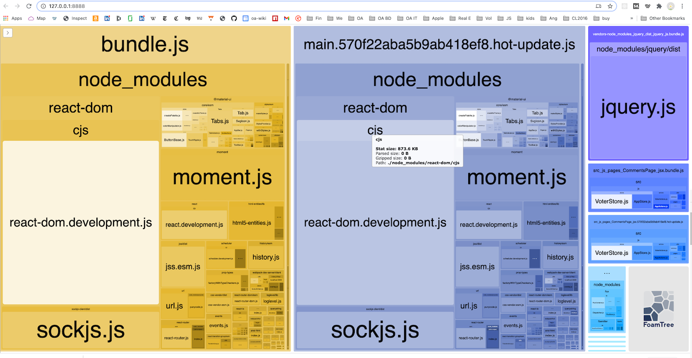

# We Vote Campaigns

This We Vote Campaigns repository contains a Node/React/Flux Javascript application. We have extensive instructions for [setting up your We Vote environment here](https://github.com/wevote/WebApp): 

Interested in [volunteering or applying for an internship](https://www.idealist.org/en/nonprofit/f917ce3db61a46cb8ad2b0d4e335f0af-we-vote-oakland#opportunities)? [Starting presentation here](https://prezi.com/5v4drd74pt6n/we-vote-introduction-strategic-landscape/). 
Please also [read about our values](https://docs.google.com/document/d/12qBXevI3mVKUsGmXL8mrDMPnWJ1SYw9zX9LGW5cozgg/edit) and 
[see our Code of Conduct](CODE_OF_CONDUCT.md)
To join us, please [review our openings here](https://www.idealist.org/en/nonprofit/f917ce3db61a46cb8ad2b0d4e335f0af-we-vote-oakland#opportunities), and express your interest by emailing JoinUs@WeVote.US

## Guidelines

- **Keep the "index.html" page very simple**. To discuss.
- **Keep the "Home" page very simple**, so that it gets to LCP (Largest Contentful Paint in (ideally) less than one second). 
- **Keep Stores and Actions pure**.  To discuss: No calls to other actions or stores from within an action or store.
- **Lazy load all Libraries** except on the "Home" page.  If a page is Lazy loaded, any imports from that page are that page will be in the page's bundle. 
- **Don't Copy Code Blindly**.  Any code brought over from the WebApp should be trimmed down to the least amount of code necessary to 
do what you wanted to, and no more. 
  - New code should be atomic. It should do what it is supposed to, and not fire off queries that aren't related to the needs of the current code.
  - If you don't know what it does don't copy it.  Commenting out is ok in the beginning.
  - To discuss: Not used setters and getters in Stores/Actions are OK.
  - Not used utility functions are OK.
- **Check bundle sizes often**.  The base bundle.js should not "exceed the recommended size limit (244 KiB)."
  - While testing with the Webpack Bundle Analyzer, know that
    - sockjs.js and webpack-dev components are part of dev Webpack and "should not" end up in a production build.
  - Webpack minifies what it can when the cli option  "--mode production" is used, so compile with `npm run start-minified` to minify. 
- **Follow styles defined on "/styles" page**.

## Webpack Bundle Analyzer
Set `const isProduction = false;` in webpack.config.js to turn on the analyzer.

## DIY Add-Ons

- [ESLint](https://www.robinwieruch.de/react-eslint-webpack-babel/)

## Installation

- `git clone git@github.com:wevote/Campaigns.git`
- `cd Campaigns`
- `cp ./src/js/config-template.js ./src/js/config.js`
- `npm install`
- `npm start`
- Visit `http://localhost:3000/`

## Useful Commands for Daily Development

- `npm install`
- `npm start`
- `npm run start-minified`

